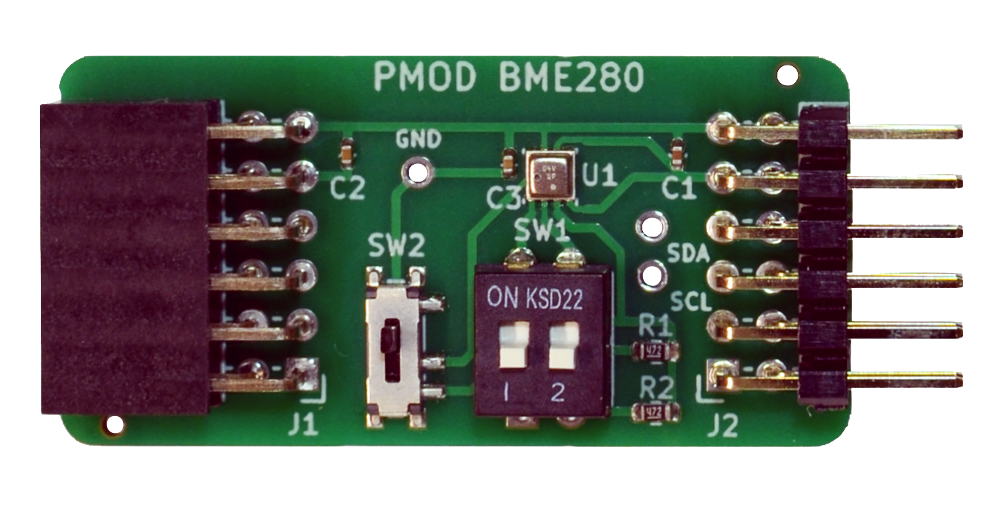
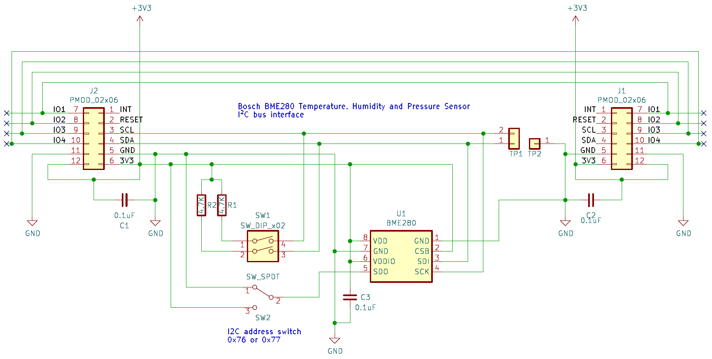
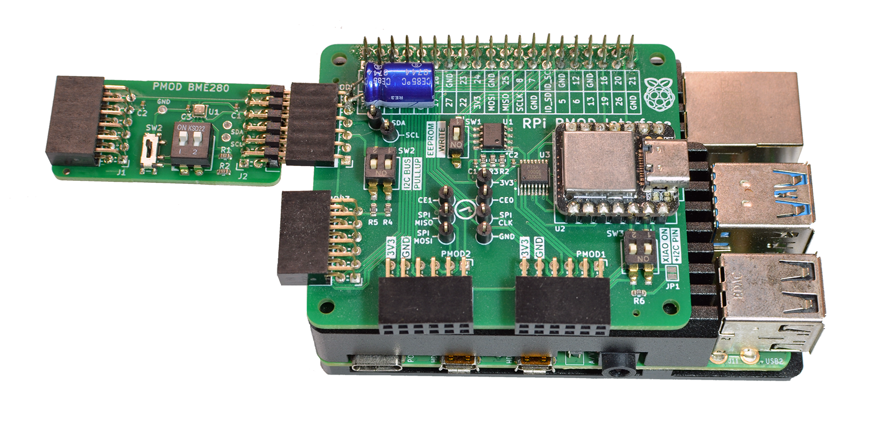
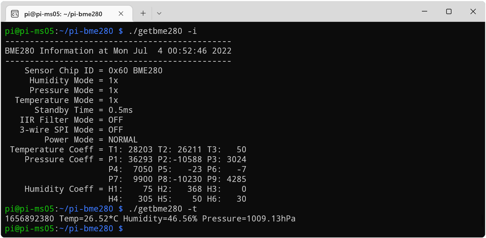
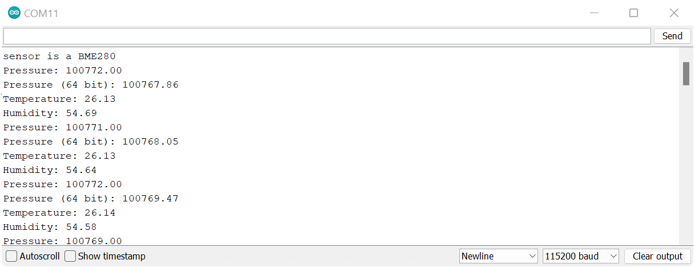

## BME280 PMOD

### Description

This PMOD connects the Bosch BME280 humidity, pressure and temperature sensor over I2C, using Digilent's PMOD interface type 6 and 6A per PMOD specification v1.3.1. The PMOD module can be chained to add additional I2C devices to the bus. The I2C pull-up resistors can be enabled/disabled using DIP switches, and switch 2 toggles the sensors I2C address between 0x76 and 0x77.

http://fpga.fm4dd.com/

### Schematic

### PCB Gerber
[BME280 PMOD Gerber V1.0](20220624-bme280-gerber-v10.zip)

### PMOD Interface Pin Assignments

PMOD |	Label |	Description
-----|--------|---------------
1    |	-     |	Not connected
2    |	-     |	Not connected
3    |	SCL   |	I2C clock
4    |  SDA   | I2C data
5    |  GND   | ground
6    |  3V3   | 3.3V
7    |	-     |	Not connected
8    |	-     |	Not connected
9    |  -     | Not connected
10   |  -     |	Not connected
11   |  GND   | ground
12   |  3V3   | 3.3V

All pins are passed through from connector J1 to J2, allowing to chain multiple type 6/6A PMODs.

### Example Code

#### Linux

Above shows the BME280 PMOD, connected to a [PMOD2RPI](https://github.com/fm4dd/pmod2rpi) interface board. When connected through the PMOD4 connector, the module can be controlled from the Raspberry Pi 4 Linux, running the [pi-bme280](https://github.com/fm4dd/pi-bme280) control program.

#### Arduino

Without any changes, we can run BME280 sample code such as the [BMx280_I2C](https://bitbucket.org/christandlg/bmx280mi/src/master/examples/BMx280_I2C/BMx280_I2C.ino) example program from the BMx280MI library provided by Gregor Christandl. The BME280 PMOD module is connected to the [PMOD2RPI](https://github.com/fm4dd/pmod2rpi) interface board. On port PMOD1, the module communicates over I2C with the onboard Seeedstudio XIAO Cortex-M0 MCU.

